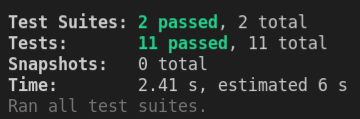

# EXPRESS MUSIC

This public repository is a copy of my branch in the private repo https://github.com/WildCodeSchool/remote-fr-lemuriens-checkpoint-3/tree/cario_franck

The goal of this project was the realization of an API back in Test Driven Development (<a href="https://www.journaldunet.fr/web-tech/guide-de-l-entreprise-digitale/1443842-test-driven-development-tout-sur-le-developpement-pilote-par-le-test/">TDD</a>) using Express. The tests were already there, I wrote the code to pass them all

---

# TO SEE THIS PROJECT IN ACTION LOCALLY :

- git clone git@github.com:Tadkozh/ExpressMusic.git
- **npm install**

- Create the DB from the _music.sql_ file in the _db_ folder
- Link the back to the DB : duplicate _.env.sample_ to _.env_ and replace with your data

- **npm start** if you want to test things with Postman or equivalent

- **npm test** if you want to see TDD in action :

---

# Subject of the checkpoint :fire:

## Disclaimer

The checkpoint is quite consequent, it's no big deal if you don't do everything before the deadline. Do your best, and most importantly HAVE FUN 😃

## :zero: Setup | 30 sec

Before starting anything technical, your first mission is to clone this project, then create a branch with your lastname and firstname like so : `lastname_firstname`

## :one: Step[1] - NodeJS / Express | 3 hours

### Getting started :point_down:

The project comes comes with ESLint and Prettier.

In the project directory, you can run different scripts:

- `npm run dev` : Runs the app in the development mode using `nodemon` on port 8000 by default. You can change it by creating a `PORT` variable in your `.env` file. (You should create this file)
- `npm start`: Runs the app in production mode. This will **not re-start when you write your code !**
- `npm run lint` : This app came with basic ESLint config (Prettier + React), you can run a check every time using this script. :collision: BEWARE :collision: If you don't have Prettier installed in your Editor with format on save, you should run it with the next script
- `npm run prettier` : It runs Prettier on all your staged files. (only useful if you don't have Prettier installed in your editor)
- `npm test -runInBand` : This is the most important command for this checkpoint. It will test your CRUDs with `jest`. More informations below.

---

**In this step, you will create an API that allows you to manage songs and albums using Node/Express**

_Please please, don't forget to make atomic commits with explicit messages_ :pray:

Here is the database schema you need to create beforehand.  
You can use either SQL database you like (MySQL, SQLite, Postgresql), but cannot use noSQL (MongoDB for example).

:warning: The keys name should be the same as the schema and case sensitive, otherwise integration tests will fail ! :warning:

_don't write `albumId` instead of `id_album` for example_.

---

### Rules

- :white_check_mark: Response bodies should be JSON.
- :white_check_mark: Request bodies should be JSON.
- :white_check_mark: `PUT` and `DELETE` request should return `204 no content`.
- :white_check_mark: Respect as much as you can REST practices
- :white_check_mark: `POST` request should return `201 created` with the associated created resource.
- :white_check_mark: Don't remove the `module.exports = app` in the `app.js` file. We need it for the tests !
- :white_check_mark: All routes should starts with `/api`

### Tests

This checkpoint comes with integration tests on most of the routes.

- :loud_sound: GET `/api/tracks`
- :loud_sound: GET `/api/tracks/1`
- :loud_sound: POST `/api/tracks`
- :loud_sound: PUT `/api/tracks`
- :loud_sound: DELETE `/api/tracks`
- :headphones: GET `/api/albums`
- :headphones: GET `/api/albums/1`
- :headphones: GET `/api/albums/1/tracks`
- :headphones: POST `/api/albums`
- :headphones: PUT `/api/albums`
- :headphones: DELETE `/api/albums`

:warning: You **NEED** to have a track in your database with the `id` 1, and an album with the `id` 1.  
Otherwise, 3 tests are going to fail.

---

### Your mission

Here are some user stories about what you need to do:

- As a user, I need to be able to retrieve the full list of tracks
- As a user, I need to be able to retrieve one track by its ID
- As a user, I need to be able to create a new track
- As a user, I need to be able to update a track
- As a user, I need to be able to delete a track
- As a user, I need to be able to retrieve the full list of albums
- As a user, I need to be able to retrieve one album by its ID
- As a user, I need to be able to retrieve the tracks list of one album
- As a user, I need to be able to create a new album
- As a user, I need to be able to update an album
- As a user, I need to be able to delete an album

_Remember: for the tests to work properly, you need an `album` with id `1` and a track with id `1` in your DB !_

---

## It's done ! Congrats !

You can now chill :beers:

